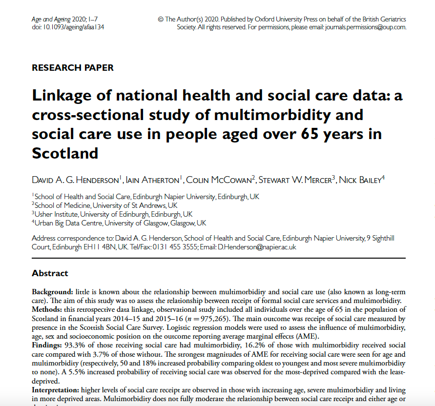
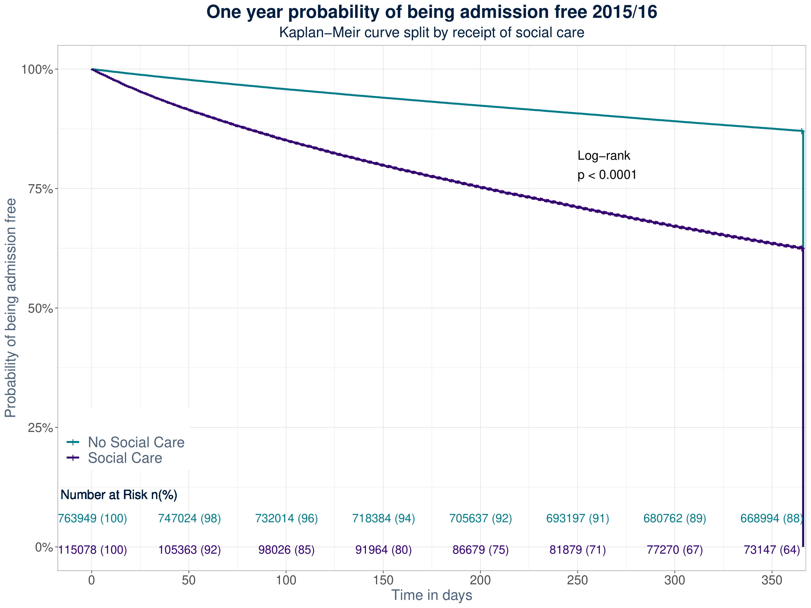

```{r setup, echo=FALSE, message=FALSE, warning=FALSE}
options(htmltools.dir.version = FALSE,
        knitr.table.format = "html",
        echo = FALSE)
library(tidyverse)
library(kableExtra)
```

## Introduction

.pull-left[
* Funded by the Economic & Social Research Council

<br/>

* Co-authors
  - Dr Iain Atherton
  - Prof Colin McCowan
  - Prof Stewart Mercer
  - Prof Nick Bailey

<br/>

* Builds on PhD research
]

.pull-right[


<br/>


]

---
## Background

* Older populations in high-income countries have led to increasing recognition of the importance of social (or long-term) care services.

<br/>

* These are a range of services that can be provided at home, in institutions or via cash benefits comprising assistance with personal care activities of daily living (ADLs), often in combination with nursing care, and/or instrumental ADLs such as domestic help

<br/>

* Historically, there has been poor collection of social care data internationally meaning this is an under-researched area

---
## Background

.pull-left[
* Importantly, there is little evidence of the interaction between health and social care services

* We have previously shown a link between multimorbidity and social care

* Aim: To identify risks for unplanned hospital admission taking account of social care receipt, multimorbidity, and sociodemographic factors. 
]

.pull-right[

]

---
## Methods

### Design

* Retrospective observational study

* Included all individuals over the age of 65 in Scotland between April 2015 and March 2016 (n=879,027)

* Data sources
 - Community Health Index (CHI) central register
 - Prescribing Information System (PIS)
 - Unscheduled Care Data Mart (UCD)
 - Social Care Survey


---
## Methods

### Measures

* Time to first unplanned hospital admission in study period (1st April 2015 - 31st March 2016)

<br/>

* Main independent variables of interest: Social Care (SCS) & Multimorbidity (proxy measurement via prescribing)

<br/>

* Also adjusted for age, sex, and socioeconomic position (SEP).

---
## Methods

### Statistics

* Kaplan Meier curves plotted to compared rates for those with/without receipt of social care

<br/>

* Cox Proportional Hazard models used to determine Hazard Ratios (HR) for independent variables on unplanned admission

---
## Results

```{r, echo=FALSE, message=FALSE, warning=FALSE}
table_1 <- read_csv("files/amd_surv_table_1.csv")
```

```{r, echo=FALSE}
table_1 %>% 
  select(-X1) %>% 
  mutate_all(~replace_na(., "")) %>% 
  mutate(
    adm = case_when(
      adm == "sex" ~ "Sex",
      adm == "age_grp" ~ "Age group",
      adm == "simd" ~ "SIMD decile of residence",
      adm == "scs_flag" ~ "Social Care Receipt",
      adm == "total_ch" ~ "BNF chapters (n)",
      adm == "care_home" ~ "Care Home resident",
      adm == "prev_adm" ~ "Prior admission?",
      TRUE ~ adm),
    Var.3 = case_when(
      Var.3 == "1" & adm == "SIMD decile of residence" ~ "1 - most deprived",
      Var.3 == "10" & adm == "SIMD decile of residence" ~ "10 - most affluent",
      Var.3 == "Not Care Home" ~ "No",
      Var.3 == "Care Home" ~ "Yes",
      Var.3 == "FALSE" ~ "No",
      Var.3 == "TRUE" ~ "Yes",
      TRUE ~ Var.3)) %>%
  select(adm, Var.3, Total, `No admission`, Admitted, p) %>% 
  rename("  " = adm,
         " " = Var.3,
         `Not admitted` = `No admission`,
         `p-value` = p) -> table_1

table_1 %>% 
  slice(1:9) %>% 
  kbl(., caption = "Table 1 Characteristics of population") %>% 
  kable_classic_2(font_size = 14)
```

---
## Results

```{r, echo=FALSE}
table_1 %>% 
  slice(10:19) %>% 
  kbl(., caption = "Table 1 Characteristics of population - continued") %>% 
  kable_classic_2(font_size = 14)
```

---
## Results

```{r, echo=FALSE}
table_1 %>% 
  slice(20:32) %>% 
  kbl(., caption = "Table 1 Characteristics of population - continued") %>% 
  kable_classic_2(font_size = 14)
```
---
## Results




---
## Results


---
## Limitations

* Descriptive study - no identification of causal links

<br/>

* Preliminary results - simple model reported here - likely to be over-fitted

<br/>

* Social Care data quality 
 - Misclassification present in SCS
 - CHI flag for care homes high specificity but low sensitivity (Burton et al, 2019)

<br/>

* Proxy measurement of multimorbidity

.footnote[Burton et al (2019) Identifying care-home residents in routine healthcare datasets: a diagnostic test accuracy study of five methods. *Age & Ageing*. **48:** 114-121. https://doi.org/10.1093/ageing/afy137]

---
## Conclusion

* Preliminary results only - treat with caution

<br/>

* Tentative evidence of an association between social care receipt and unplanned hospital admission

<br/>

* Would be an important finding in the context of integration of health and social care services in Scotland. 

<br/>

* Routine collection of high quality social care data is required internationally to further understand how these services interact

---
class: center, middle

## Thanks!


Slides created via the R package [**xaringan**](https://github.com/yihui/xaringan) and available on my GitHub (davidhen).

Twitter: @_davidhen
